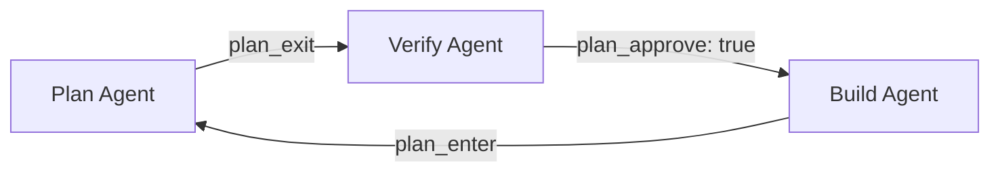
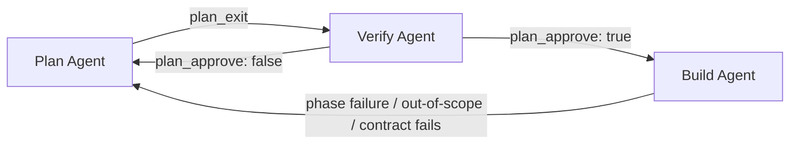

# js

To install dependencies:

```bash
bun install
```

To run:

```bash
bun run index.ts
```

This project was created using `bun init` in bun v1.2.12. [Bun](https://bun.sh) is a fast all-in-one JavaScript runtime.

## Symbolic AI Workflow

### Todo

- [x] Plan mode — Multi-phase planning (explore -> design -> review -> write plan files -> exit)
- [x] Verify mode — Policy validation, contract generation, and contract execution
- [x] In-scope limitation — Per-phase `scope` array enforces which files each phase may write to
- [ ] File scope checking during plan — Validate scope entries exist and are consistent
- [ ] Consistent stage display for plan on build mode — Ensure plan state is correctly reflected in the TUI when build mode references plan phases

### Workflow Diagrams

**Manual Mode**



**Auto-Retry Mode** (`OPENCODE_PLAN_AUTO_RETRY`)


